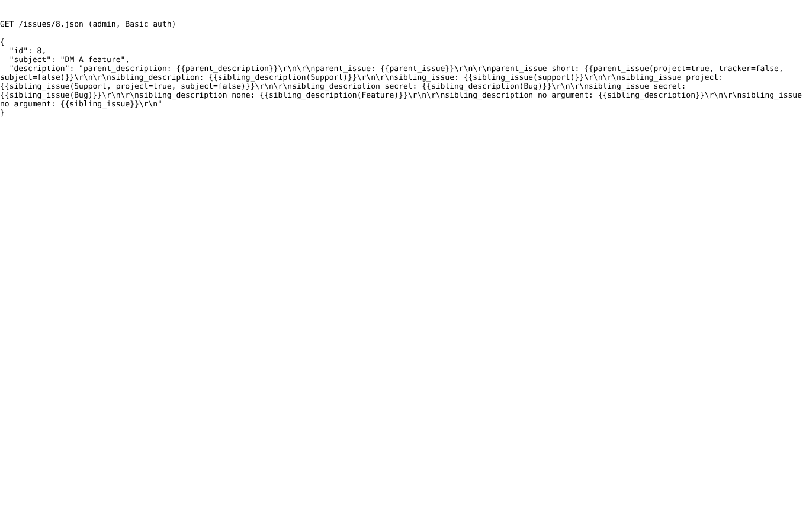

# api

Run 2026-10-06T19:36:44.781Z against http://127.0.0.1:3000.

| screenshot | user | URL | shows |
|---|---|---|---|
|  | admin | `/issues/8.json` | REST API: the description is delivered as typed, macros unexpanded; webhooks use the same payload, so they are consistent and need no change |
