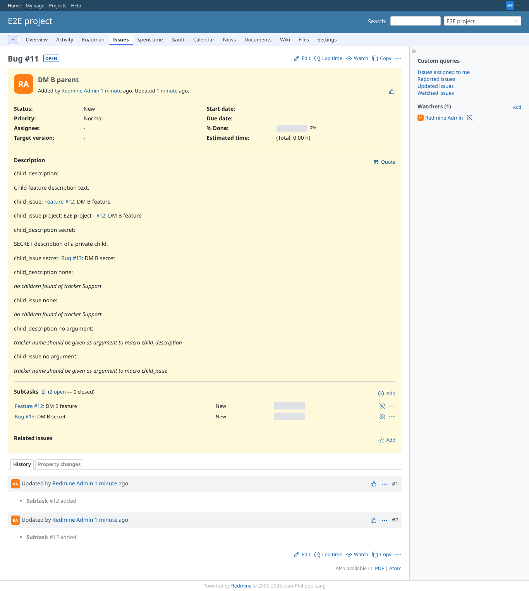
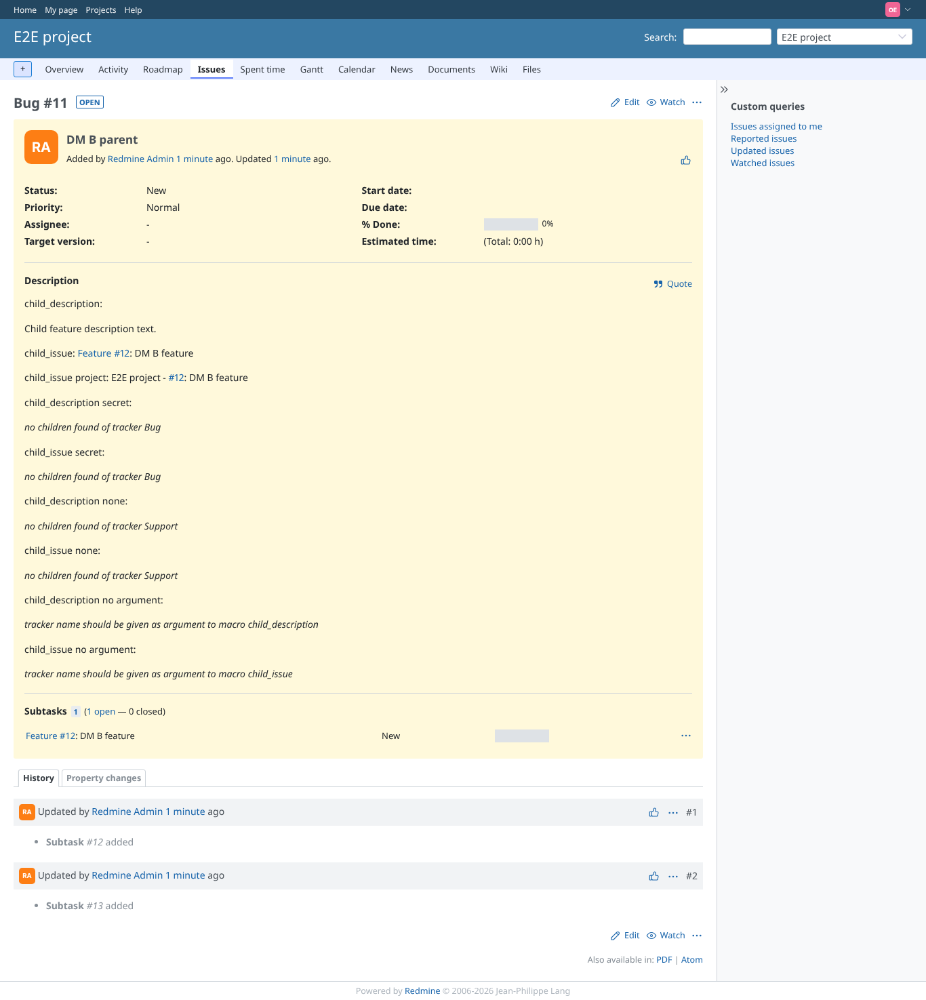

# child_description

Run 2026-10-06T19:36:52.800Z against http://127.0.0.1:3000.

| screenshot | user | URL | shows |
|---|---|---|---|
|  | manager | `/issues/11` | Manager: description of the Feature child, the private Bug child, and the no-match message |
|  | reporter | `/issues/11` | Reporter: the private child is skipped |
|  | outsider | `/issues/11` | Non-member on a public project: same as reporter, nothing leaks |
|  | reporter | `/issues/11` | Failure path: no argument |
