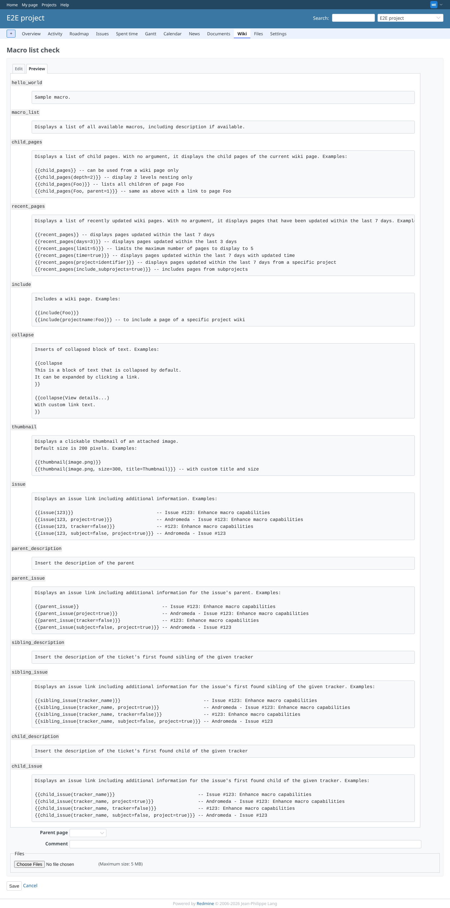

# macro_list

Run 2026-10-06T19:37:05.967Z against http://127.0.0.1:3000.

| screenshot | user | URL | shows |
|---|---|---|---|
|  | manager | `/projects/e2e-project/wiki/Macro_list_check/edit` | Manager: {{macro_list}} lists the six macros of the plugin with their descriptions |
|  | admin | `/settings/plugin/redmine_description_macros` | Settings page: the hint explains how to get the list of macros |
