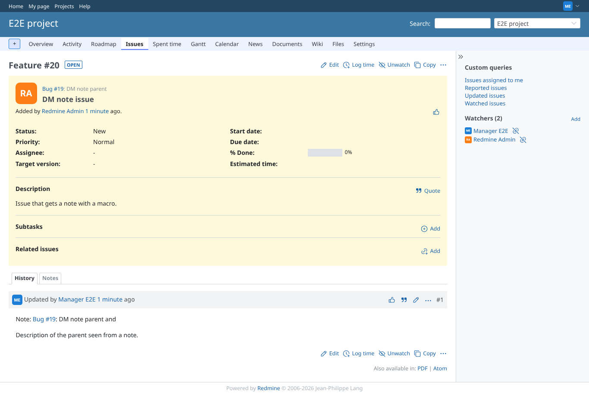
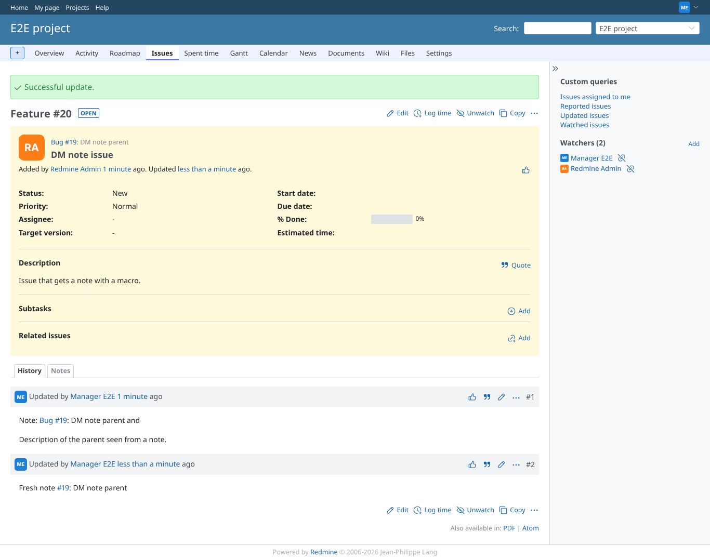
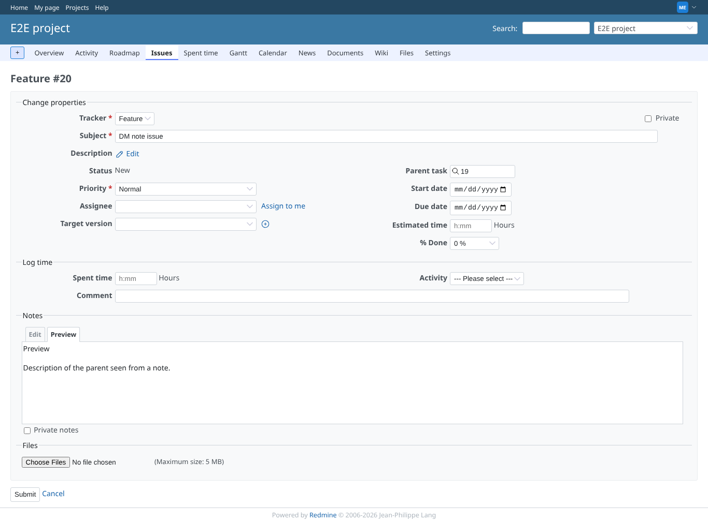

# note

Run 2026-10-06T19:37:11.173Z against http://127.0.0.1:3000.

| screenshot | user | URL | shows |
|---|---|---|---|
|  | manager | `/issues/20` | Note with {{parent_issue}} and {{parent_description}}: both resolve through the journal to its issue |
|  | manager | `/issues/20` | A note typed through the form: the macro is expanded in the saved note |
|  | manager | `/issues/20/edit` | Preview of a note: the macro is expanded (the preview has no journal yet, so the issue comes from the form) |
