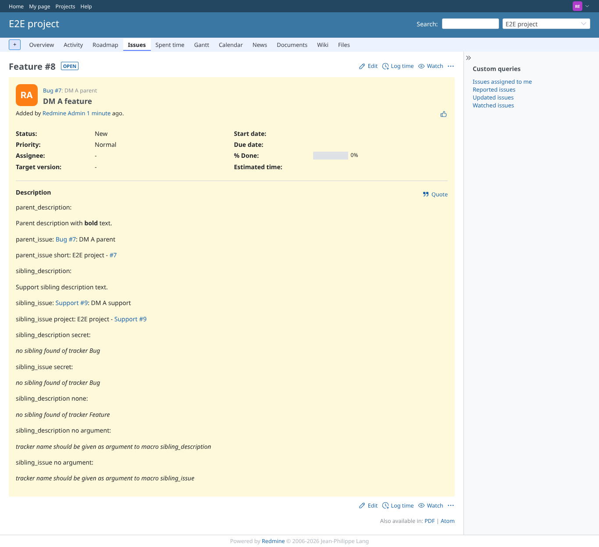
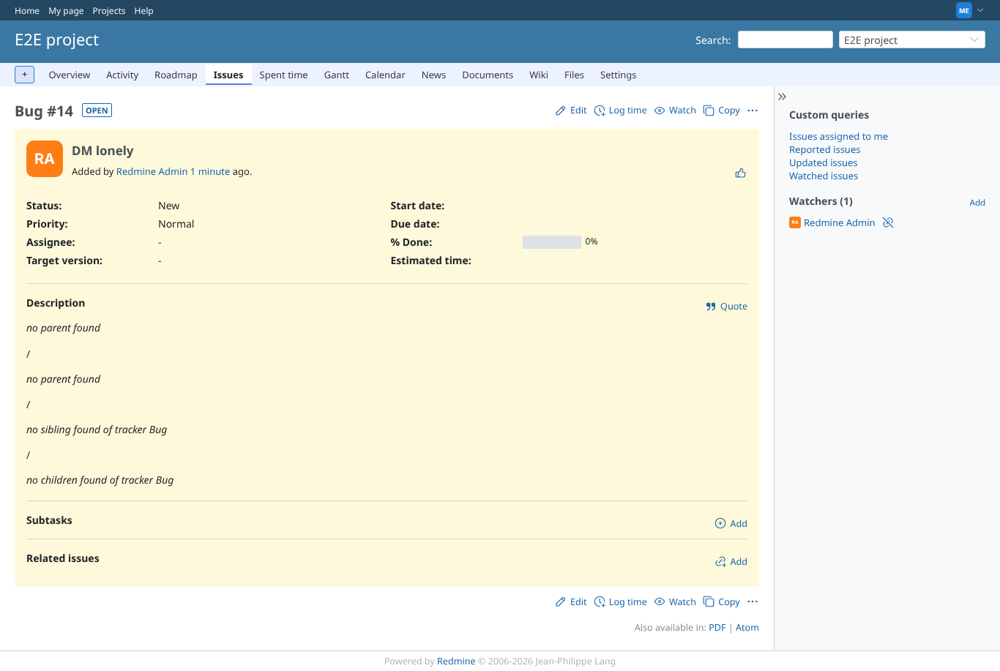
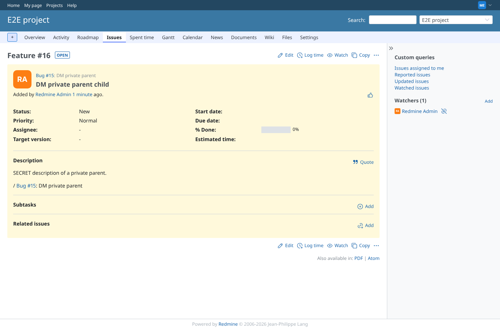

# parent_description

Run 2026-10-06T19:37:20.935Z against http://127.0.0.1:3000.

| screenshot | user | URL | shows |
|---|---|---|---|
|  | manager | `/issues/8` | Manager: the description of the parent is inserted, formatted (bold) |
|  | reporter | `/issues/8` | Reporter (no plugin permissions exist): same result |
|  | manager | `/issues/14` | Failure path: issue without a parent shows "no parent found" |
|  | reporter | `/issues/16` | Failure path: a parent the user may not see shows "parent not visible", no content |
|  | manager | `/issues/16` | Manager may see the private parent, so its description is inserted |
