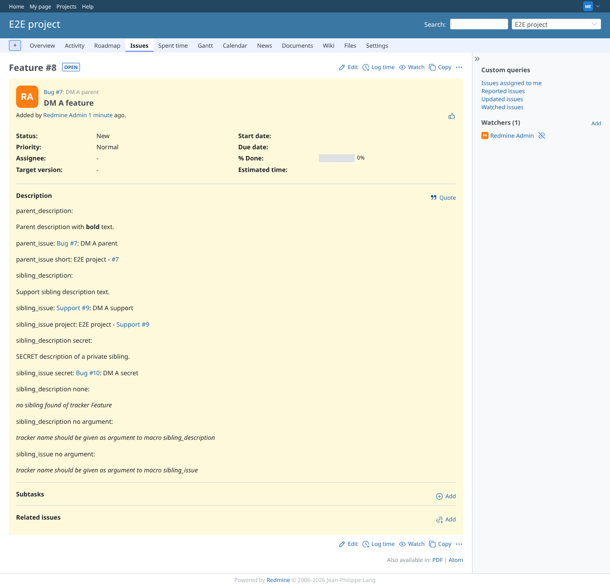
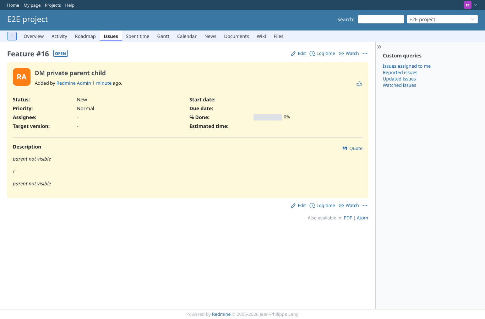

# parent_issue

Run 2026-10-06T19:37:27.618Z against http://127.0.0.1:3000.

| screenshot | user | URL | shows |
|---|---|---|---|
|  | manager | `/issues/8` | Manager: link to the parent, and the project=true tracker=false subject=false variant |
|  | manager | `/issues/14` | Failure path: no parent |
|  | reporter | `/issues/16` | Failure path (was a leak): invisible parent no longer shows its number or subject |
|  | manager | `/issues/16` | Manager sees the link to the private parent |
