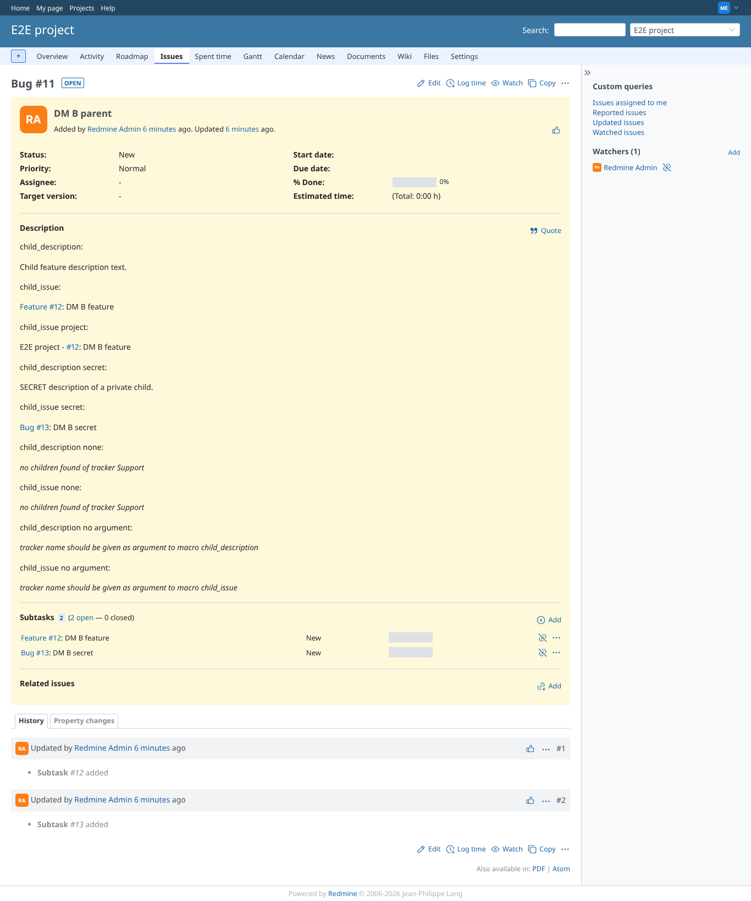
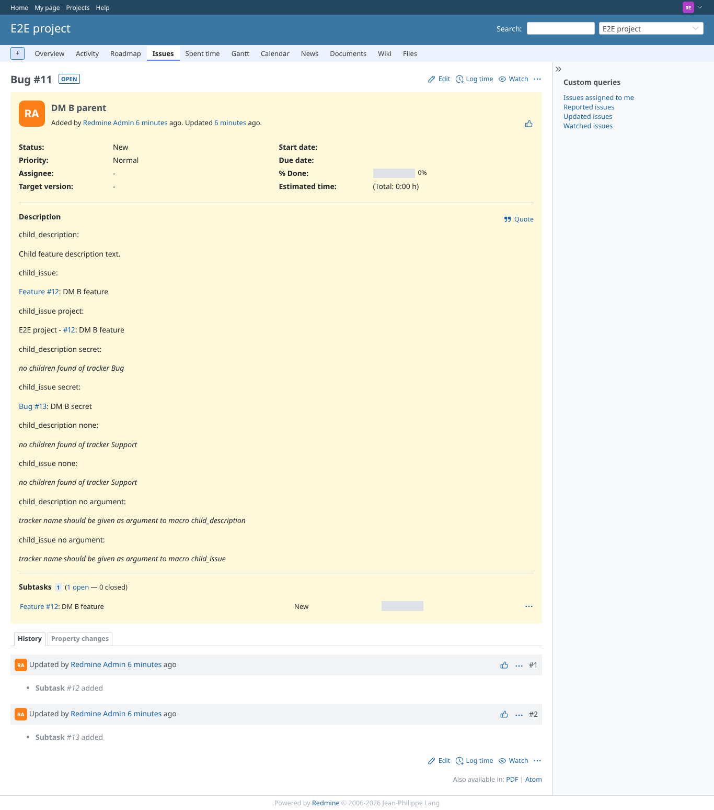

# child_issue

Run 2026-10-06T19:32:07.027Z against http://127.0.0.1:3000.

| screenshot | user | URL | shows |
|---|---|---|---|
|  | manager | `/issues/11` | Manager: child link (lower case tracker), project=true tracker=false, and the private child |
|  | reporter | `/issues/11` | Reporter: private child not linked (was a leak) |
|  | outsider | `/issues/11` | Non-member: same |
|  | reporter | `/issues/11` | Failure path: no argument |

## Problems

- DM B parent as manager: expected "child_issue: Feature #" in:
child_description:

Child feature description text.

child_issue:

Feature #12: DM B feature

child_issue project:

E2E project - #12: DM B feature

child_description secret:

SECRET description of a private child.

child_issue secret:

Bug #13: DM B secret

child_description none:

no children found of tracker Support

child_issue none:

no children found of tracker Support

child_description no argument:

tracker name should be given as argument to macro child_description

child_issue no argument:

tracker name should be given as argument to macro child_issue
- DM B parent as manager: expected "child_issue secret: Bug #" in:
child_description:

Child feature description text.

child_issue:

Feature #12: DM B feature

child_issue project:

E2E project - #12: DM B feature

child_description secret:

SECRET description of a private child.

child_issue secret:

Bug #13: DM B secret

child_description none:

no children found of tracker Support

child_issue none:

no children found of tracker Support

child_description no argument:

tracker name should be given as argument to macro child_description

child_issue no argument:

tracker name should be given as argument to macro child_issue
- child link lost its a.issue class
- DM B parent as reporter: expected "child_issue: Feature #" in:
child_description:

Child feature description text.

child_issue:

Feature #12: DM B feature

child_issue project:

E2E project - #12: DM B feature

child_description secret:

no children found of tracker Bug

child_issue secret:

Bug #13: DM B secret

child_description none:

no children found of tracker Support

child_issue none:

no children found of tracker Support

child_description no argument:

tracker name should be given as argument to macro child_description

child_issue no argument:

tracker name should be given as argument to macro child_issue
- DM B parent as reporter: "DM B secret" must not be shown in:
child_description:

Child feature description text.

child_issue:

Feature #12: DM B feature

child_issue project:

E2E project - #12: DM B feature

child_description secret:

no children found of tracker Bug

child_issue secret:

Bug #13: DM B secret

child_description none:

no children found of tracker Support

child_issue none:

no children found of tracker Support

child_description no argument:

tracker name should be given as argument to macro child_description

child_issue no argument:

tracker name should be given as argument to macro child_issue
- DM B parent as outsider: "DM B secret" must not be shown in:
child_description:

Child feature description text.

child_issue:

Feature #12: DM B feature

child_issue project:

E2E project - #12: DM B feature

child_description secret:

no children found of tracker Bug

child_issue secret:

Bug #13: DM B secret

child_description none:

no children found of tracker Support

child_issue none:

no children found of tracker Support

child_description no argument:

tracker name should be given as argument to macro child_description

child_issue no argument:

tracker name should be given as argument to macro child_issue
