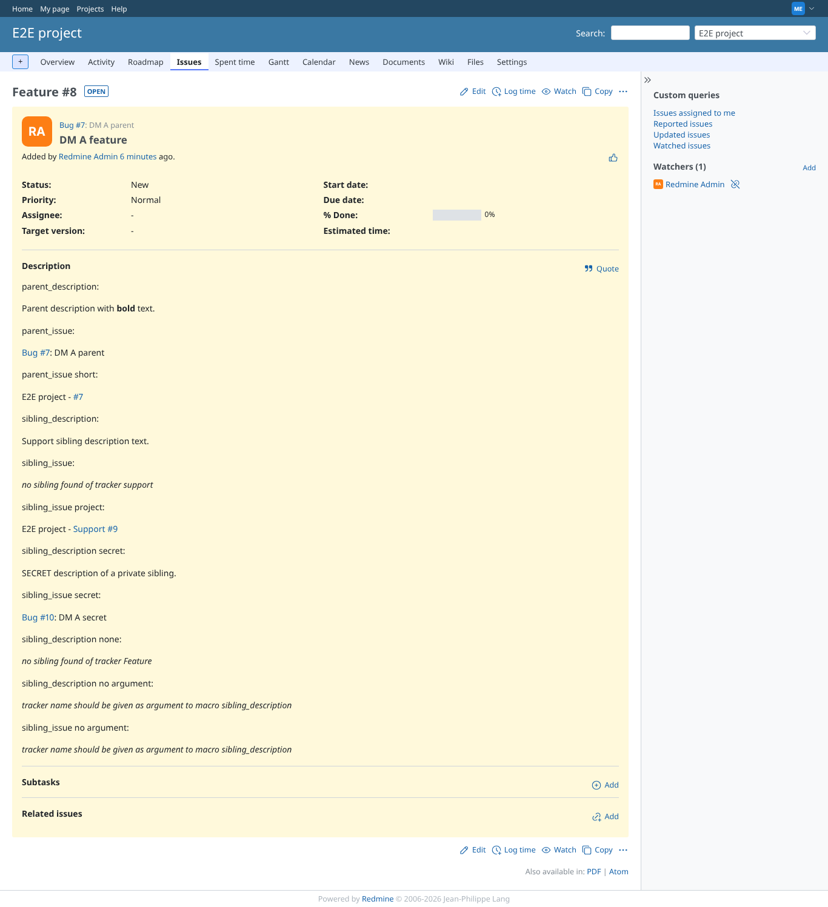
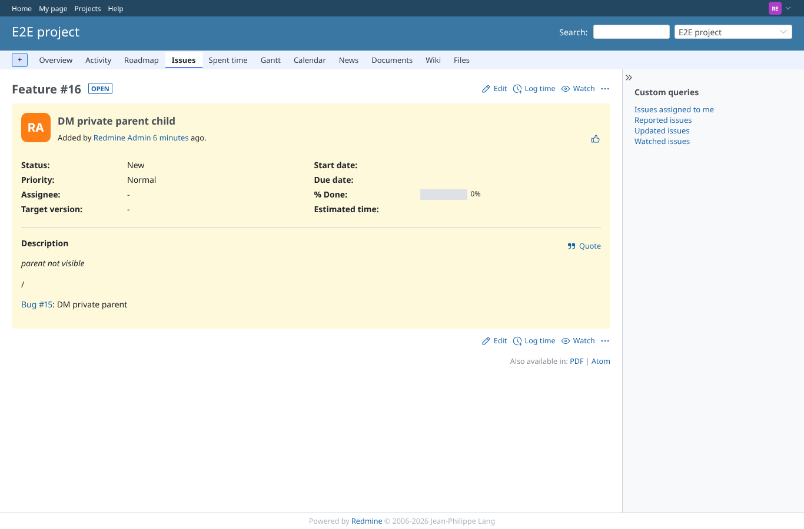
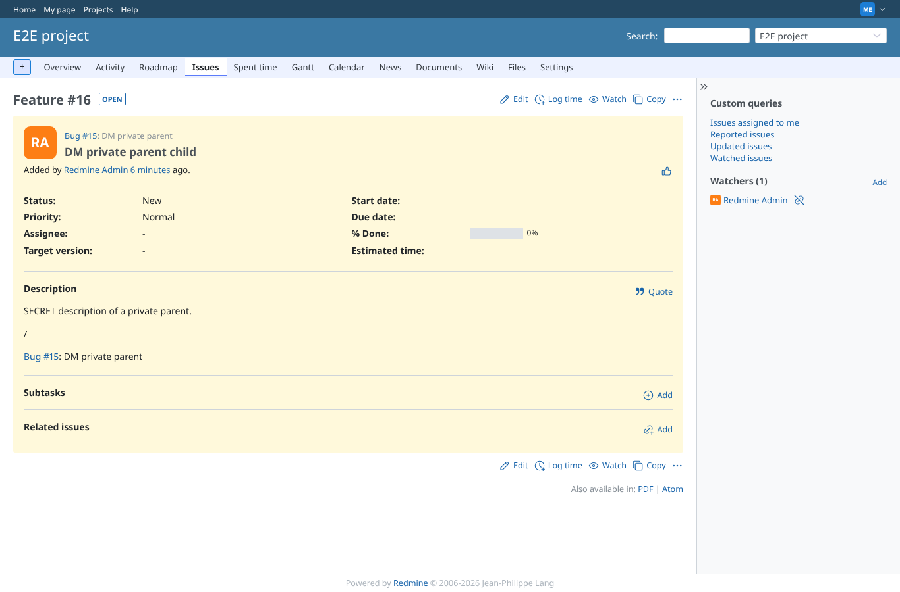

# parent_issue

Run 2026-10-06T19:32:21.400Z against http://127.0.0.1:3000.

| screenshot | user | URL | shows |
|---|---|---|---|
|  | manager | `/issues/8` | Manager: link to the parent, and the project=true tracker=false subject=false variant |
|  | manager | `/issues/14` | Failure path: no parent |
|  | reporter | `/issues/16` | Failure path (was a leak): invisible parent no longer shows its number or subject |
|  | manager | `/issues/16` | Manager sees the link to the private parent |

## Problems

- DM A feature as manager: expected "parent_issue: Bug #" in:
parent_description:

Parent description with bold text.

parent_issue:

Bug #7: DM A parent

parent_issue short:

E2E project - #7

sibling_description:

Support sibling description text.

sibling_issue:

no sibling found of tracker support

sibling_issue project:

E2E project - Support #9

sibling_description secret:

SECRET description of a private sibling.

sibling_issue secret:

Bug #10: DM A secret

sibling_description none:

no sibling found of tracker Feature

sibling_description no argument:

tracker name should be given as argument to macro sibling_description

sibling_issue no argument:

tracker name should be given as argument to macro sibling_description
- DM A feature as manager: expected "parent_issue short: E2E project - #" in:
parent_description:

Parent description with bold text.

parent_issue:

Bug #7: DM A parent

parent_issue short:

E2E project - #7

sibling_description:

Support sibling description text.

sibling_issue:

no sibling found of tracker support

sibling_issue project:

E2E project - Support #9

sibling_description secret:

SECRET description of a private sibling.

sibling_issue secret:

Bug #10: DM A secret

sibling_description none:

no sibling found of tracker Feature

sibling_description no argument:

tracker name should be given as argument to macro sibling_description

sibling_issue no argument:

tracker name should be given as argument to macro sibling_description
- the parent link is not an a.issue (class lost)
- DM private parent child as reporter: "DM private parent" must not be shown in:
parent not visible

/

Bug #15: DM private parent
- DM private parent child as reporter: "Bug #" must not be shown in:
parent not visible

/

Bug #15: DM private parent
