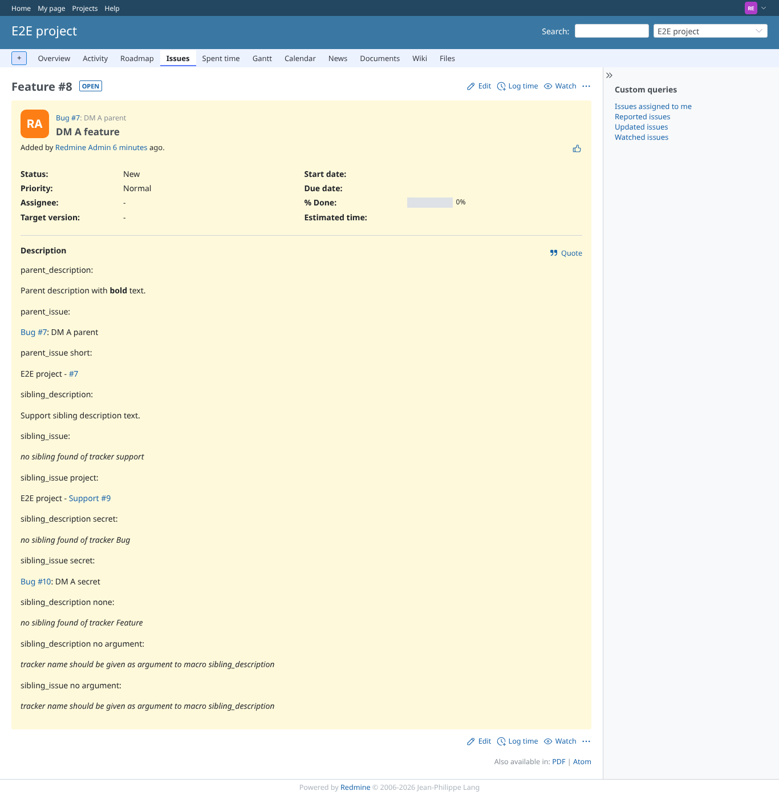
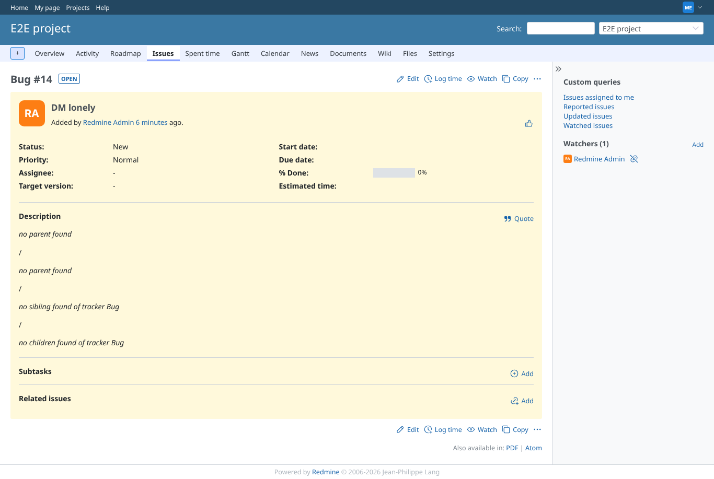

# sibling_issue

Run 2026-10-06T19:32:14.325Z against http://127.0.0.1:3000.

| screenshot | user | URL | shows |
|---|---|---|---|
|  | manager | `/issues/8` | Manager: sibling link (tracker given in lower case), project=true variant, and the private sibling the manager may see |
|  | reporter | `/issues/8` | Reporter: the private sibling is not linked (was a leak: its subject was shown) |
|  | reporter | `/issues/8` | Failure path: no argument, message names sibling_issue (it named sibling_description before) |
|  | manager | `/issues/14` | Failure path: no parent |

## Problems

- DM A feature as manager: expected "sibling_issue: Support #" in:
parent_description:

Parent description with bold text.

parent_issue:

Bug #7: DM A parent

parent_issue short:

E2E project - #7

sibling_description:

Support sibling description text.

sibling_issue:

no sibling found of tracker support

sibling_issue project:

E2E project - Support #9

sibling_description secret:

SECRET description of a private sibling.

sibling_issue secret:

Bug #10: DM A secret

sibling_description none:

no sibling found of tracker Feature

sibling_description no argument:

tracker name should be given as argument to macro sibling_description

sibling_issue no argument:

tracker name should be given as argument to macro sibling_description
- DM A feature as manager: expected "DM A support" in:
parent_description:

Parent description with bold text.

parent_issue:

Bug #7: DM A parent

parent_issue short:

E2E project - #7

sibling_description:

Support sibling description text.

sibling_issue:

no sibling found of tracker support

sibling_issue project:

E2E project - Support #9

sibling_description secret:

SECRET description of a private sibling.

sibling_issue secret:

Bug #10: DM A secret

sibling_description none:

no sibling found of tracker Feature

sibling_description no argument:

tracker name should be given as argument to macro sibling_description

sibling_issue no argument:

tracker name should be given as argument to macro sibling_description
- DM A feature as manager: expected "sibling_issue secret: Bug #" in:
parent_description:

Parent description with bold text.

parent_issue:

Bug #7: DM A parent

parent_issue short:

E2E project - #7

sibling_description:

Support sibling description text.

sibling_issue:

no sibling found of tracker support

sibling_issue project:

E2E project - Support #9

sibling_description secret:

SECRET description of a private sibling.

sibling_issue secret:

Bug #10: DM A secret

sibling_description none:

no sibling found of tracker Feature

sibling_description no argument:

tracker name should be given as argument to macro sibling_description

sibling_issue no argument:

tracker name should be given as argument to macro sibling_description
- sibling link lost its a.issue class
- DM A feature as reporter: expected "sibling_issue: Support #" in:
parent_description:

Parent description with bold text.

parent_issue:

Bug #7: DM A parent

parent_issue short:

E2E project - #7

sibling_description:

Support sibling description text.

sibling_issue:

no sibling found of tracker support

sibling_issue project:

E2E project - Support #9

sibling_description secret:

no sibling found of tracker Bug

sibling_issue secret:

Bug #10: DM A secret

sibling_description none:

no sibling found of tracker Feature

sibling_description no argument:

tracker name should be given as argument to macro sibling_description

sibling_issue no argument:

tracker name should be given as argument to macro sibling_description
- DM A feature as reporter: "DM A secret" must not be shown in:
parent_description:

Parent description with bold text.

parent_issue:

Bug #7: DM A parent

parent_issue short:

E2E project - #7

sibling_description:

Support sibling description text.

sibling_issue:

no sibling found of tracker support

sibling_issue project:

E2E project - Support #9

sibling_description secret:

no sibling found of tracker Bug

sibling_issue secret:

Bug #10: DM A secret

sibling_description none:

no sibling found of tracker Feature

sibling_description no argument:

tracker name should be given as argument to macro sibling_description

sibling_issue no argument:

tracker name should be given as argument to macro sibling_description
- DM A feature as reporter: expected "tracker name should be given as argument to macro sibling_issue" in:
parent_description:

Parent description with bold text.

parent_issue:

Bug #7: DM A parent

parent_issue short:

E2E project - #7

sibling_description:

Support sibling description text.

sibling_issue:

no sibling found of tracker support

sibling_issue project:

E2E project - Support #9

sibling_description secret:

no sibling found of tracker Bug

sibling_issue secret:

Bug #10: DM A secret

sibling_description none:

no sibling found of tracker Feature

sibling_description no argument:

tracker name should be given as argument to macro sibling_description

sibling_issue no argument:

tracker name should be given as argument to macro sibling_description
