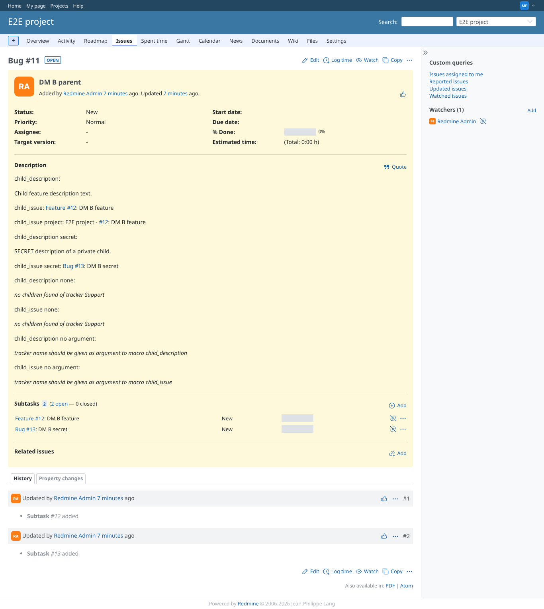
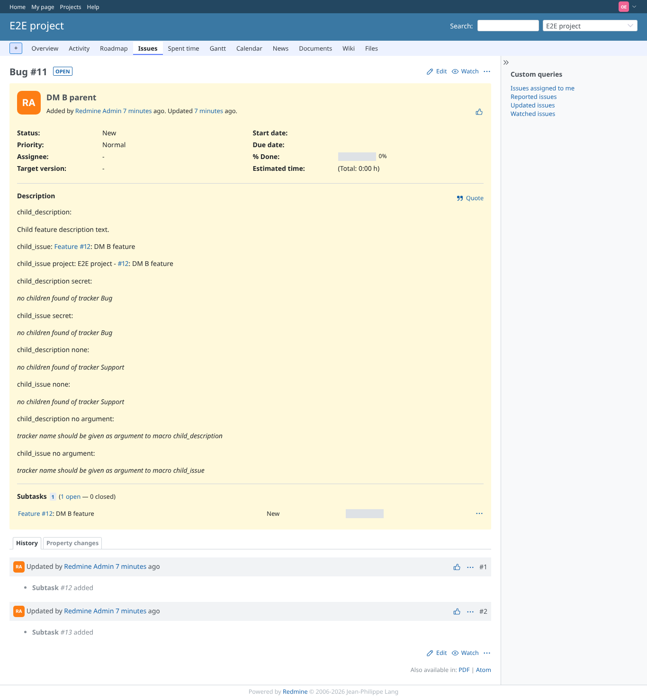

# child_issue

Run 2026-10-06T19:33:36.179Z against http://127.0.0.1:3000.

| screenshot | user | URL | shows |
|---|---|---|---|
|  | manager | `/issues/11` | Manager: child link (lower case tracker), project=true tracker=false, and the private child |
|  | reporter | `/issues/11` | Reporter: private child not linked (was a leak) |
|  | outsider | `/issues/11` | Non-member: same |
|  | reporter | `/issues/11` | Failure path: no argument |
