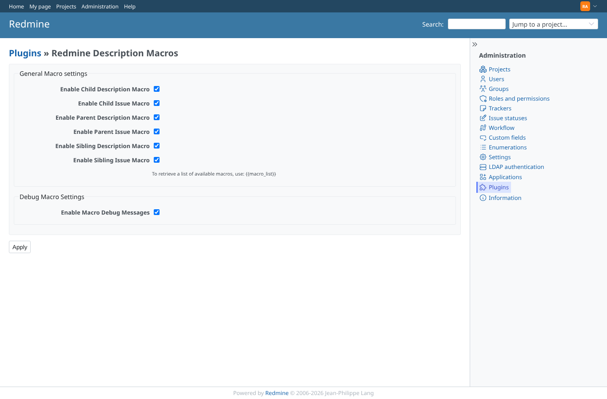
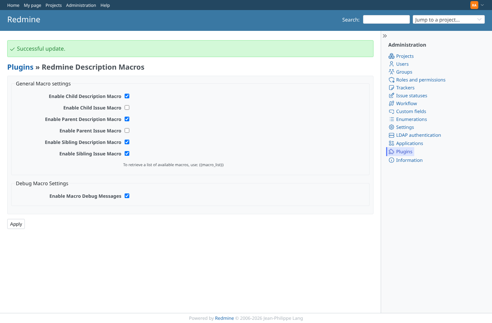
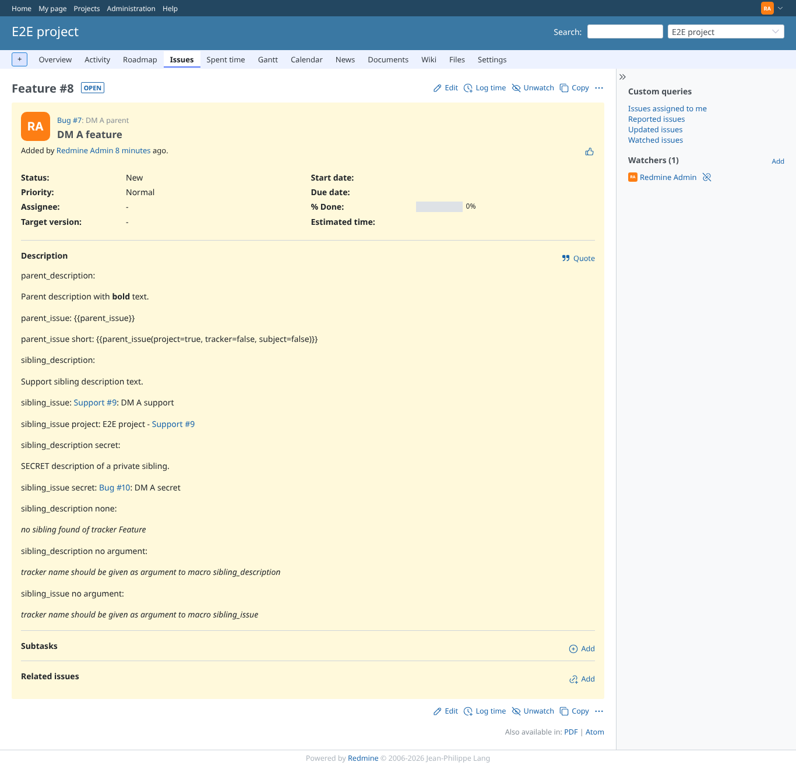
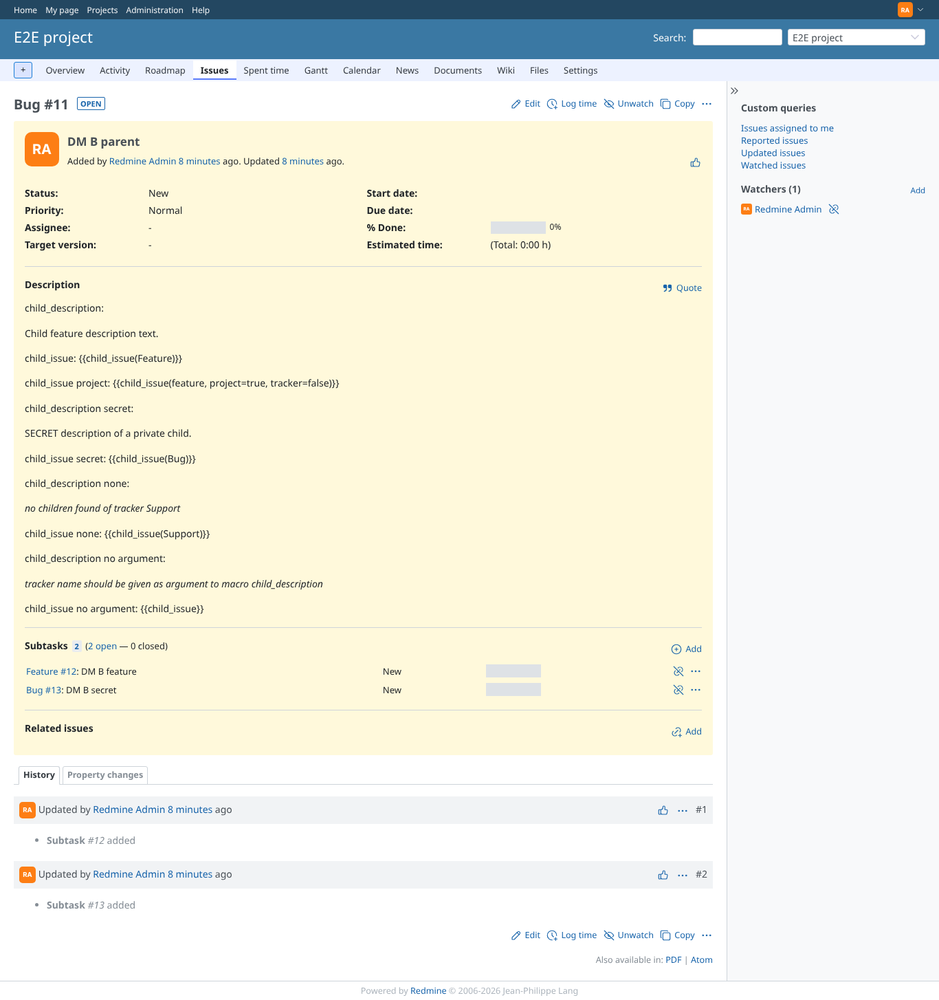
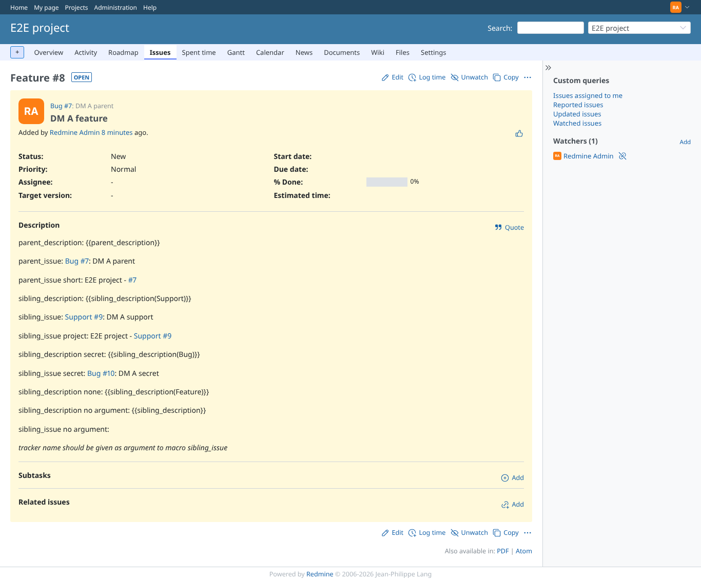
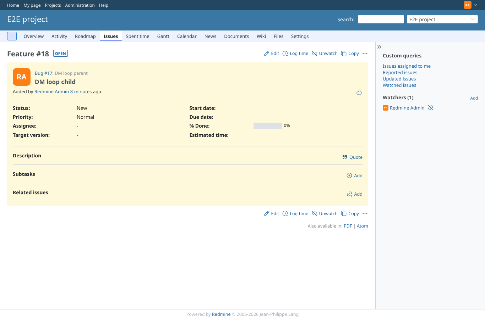
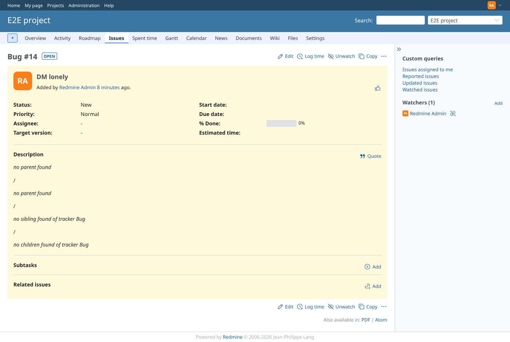
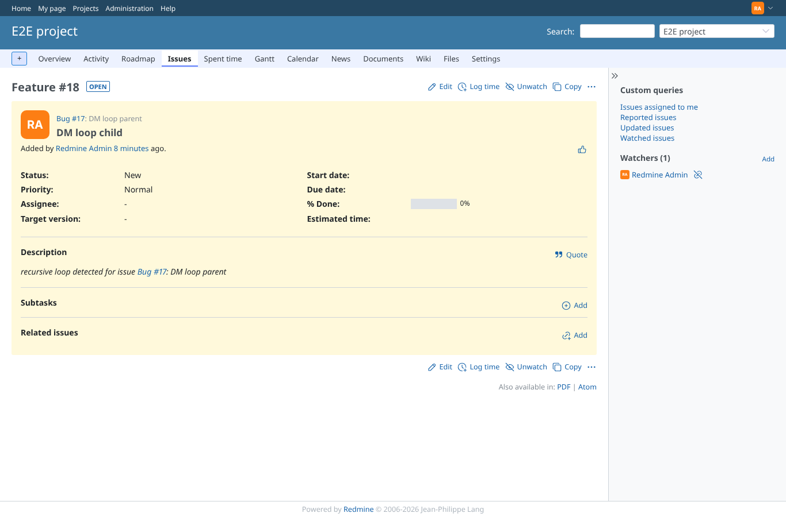

# settings

Run 2026-10-06T19:34:20.655Z against http://127.0.0.1:3000.

| screenshot | user | URL | shows |
|---|---|---|---|
|  | admin | `/settings/plugin/redmine_description_macros` | Admin: plugin settings, a checkbox per macro and one for the debug messages, all on |
|  | admin | `/settings/plugin/redmine_description_macros` | After saving with parent_issue and child_issue off |
|  | admin | `/issues/8` | parent_issue off: the macro text stays as it was typed, the other macros still work |
|  | admin | `/issues/11` | child_issue off: left as typed, child_description still works |
|  | admin | `/issues/8` | The three description macros off, the issue macros on again |
|  | admin | `/issues/18` | Debug messages off: the loop notice is not shown (empty description) |
|  | admin | `/issues/14` | Debug messages off: functional messages ("no parent found") stay |
|  | admin | `/issues/18` | Everything on again: the loop notice is back |
|  | manager | `/settings/plugin/redmine_description_macros` | Failure path: a project manager (not admin) is refused the settings page |
|  | reporter | `/settings/plugin/redmine_description_macros` | Failure path: reporter refused |
|  | anonymous | `/login?back_url=http%3A%2F%2F127.0.0.1%3A3000%2Fsettings%2Fplugin%2Fredmine_description_macros` | Failure path: anonymous is sent to the login form |
