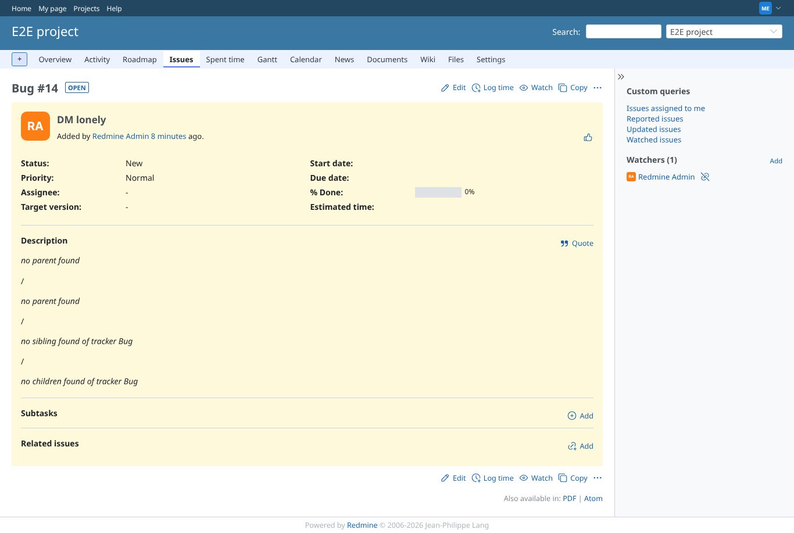

# sibling_description

Run 2026-10-06T19:34:27.796Z against http://127.0.0.1:3000.

| screenshot | user | URL | shows |
|---|---|---|---|
|  | manager | `/issues/8` | Manager: description of the sibling of tracker Support; the private Bug sibling is visible to a manager |
|  | reporter | `/issues/8` | Reporter: the private sibling is skipped, nothing leaks |
|  | reporter | `/issues/8` | Failure path: macro without tracker argument names the macro |
|  | manager | `/issues/14` | Failure path: issue without parent has no siblings |
