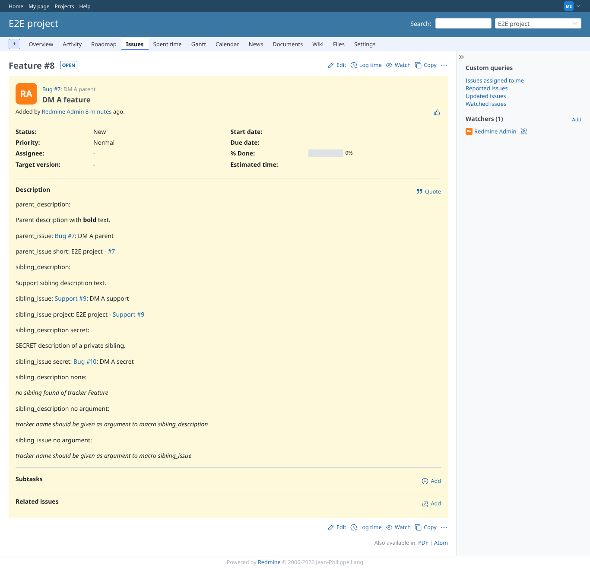
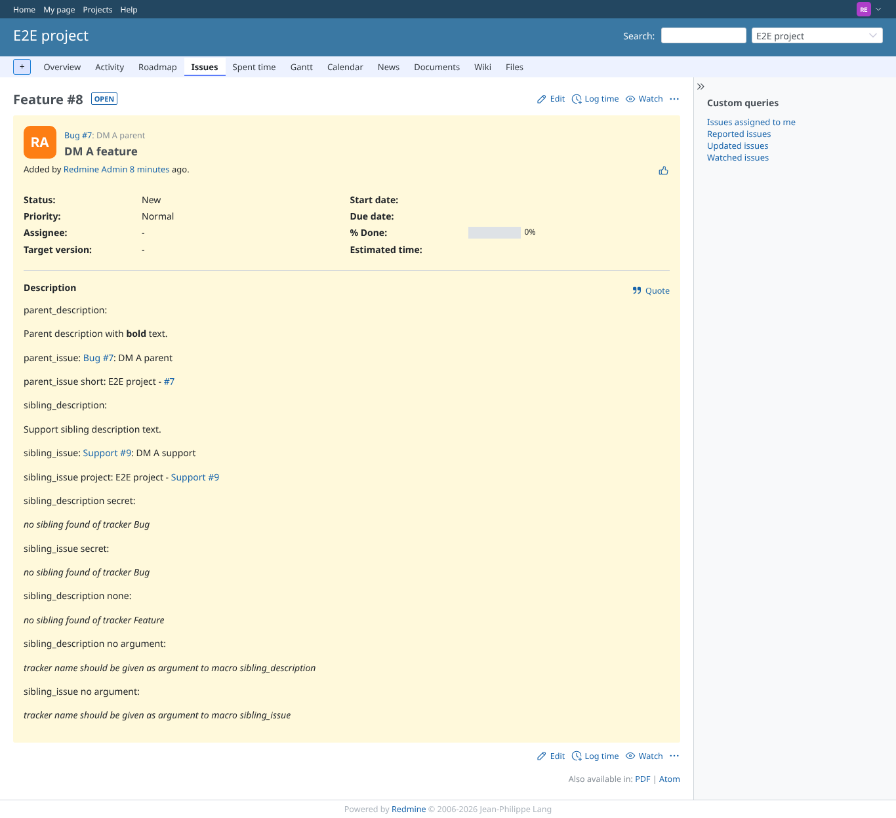

# sibling_issue

Run 2026-10-06T19:34:34.828Z against http://127.0.0.1:3000.

| screenshot | user | URL | shows |
|---|---|---|---|
|  | manager | `/issues/8` | Manager: sibling link (tracker given in lower case), project=true variant, and the private sibling the manager may see |
|  | reporter | `/issues/8` | Reporter: the private sibling is not linked (was a leak: its subject was shown) |
|  | reporter | `/issues/8` | Failure path: no argument, message names sibling_issue (it named sibling_description before) |
|  | manager | `/issues/14` | Failure path: no parent |
